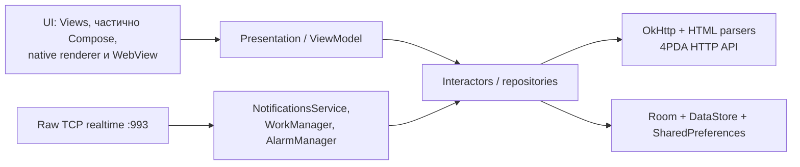

# Технический и продуктовый аудит ProPDA

**Дата:** 26 июля 2026 г.

**Проверенный коммит:** `c4dae680` (`main`, локально на 3 коммита впереди `origin/main`)

**Версия приложения:** `3.3.2`

**Объект аудита:** Android-приложение, модули `:app` и `:baselineprofile`

Полная матрица сборок/тестов была запущена на `877d6488`. Во время подготовки отчёта в общей рабочей копии появился не относящийся к аудиту коммит `c4dae680` (39 добавленных/изменённых строк в navigation use case, native topic и его тесте). Его diff просмотрен, а `ThemeNavigationUseCaseTest` проверен отдельно; выводы аудита он не меняет.

## 1. Итог

Текущий релизный статус — **красный**. Приложение функционально насыщено, собирается в debug и release, использует современный Android-стек, R8 и Baseline Profile, а тестовая база заметно больше средней для подобного legacy-клиента. Но выпускать текущий `storeRelease` нельзя до устранения P0-проблем:

1. В новостном WebView есть реальная граница атаки: сетевой HTML очищается регулярными выражениями, допускает произвольные HTTPS-iframe и затем получает `INews` через `addJavascriptInterface`. Android предоставляет такой объект всем frame без возможности проверить origin. Мост содержит действия от имени авторизованного пользователя.
2. Реально собранный `storeRelease` AAB подписан сертификатом **Android Debug**. Конфигурация молча подменяет отсутствующий upstream release key на debug key.
3. Unit-тесты красные: **13 failed / 2 464**, ещё **31 skipped**. Среди отказов — комментарии новостей, poll binding, история, QMS, избранное и renderer постов.
4. `targetSdk=35`, а с **31 августа 2026 г.** новые версии в Google Play должны target Android 16 / API 36.
5. Store-вариант наследует `USE_EXACT_ALARM` для фонового polling форума. Это не соответствует допустимым Play-сценариям alarm/timer/calendar и может заблокировать публикацию.

До закрытия этих пунктов расширение функциональности следует ограничить исправлениями, необходимыми для релиза, безопасности и наблюдаемости.

## 2. Что было проверено

### 2.1 Инвентаризация

| Показатель | Значение |
|---|---:|
| Kotlin-файлы production | 824 |
| Production LOC | ~138 100 |
| Unit test-файлы | 366, из них 328 `*Test.kt` |
| Test LOC | ~52 239 |
| Самый большой класс | `NativeTopicFragment.kt`, 5 149 строк |
| Ресурсы `app/src/main` | ~27 МБ |
| Release AAB `storeRelease` | 19 МБ |
| Debug APK | 29 МБ stable / 30 МБ store |
| Модули | 2 (`app`, `baselineprofile`) |
| CI workflow | отсутствует |
| Instrumentation/UI-тесты `app` | отсутствуют |
| Macrobenchmark-тесты | 8 в `baselineprofile`, требуют устройство |

### 2.2 Выполненные проверки

| Проверка | Результат |
|---|---|
| Gradle 8.13 / JDK 17 | успешно |
| `assembleStableDebug` | успешно |
| `assembleStoreDebug` | успешно |
| `bundleStoreRelease` | успешно за 3 мин 14 с; R8 и `lintVital` прошли |
| Сертификат `storeRelease` | **Android Debug**, релизный дефект |
| `testStableDebugUnitTest` | **failed: 13 / 2 464**, skipped: 31 |
| `detekt` | **failed: 24 568 findings** |
| `checkJetifier` | успешно; Jetifier нужен только из-за `sectioned-recyclerview:0.5.0` → Support Library 25.3.1 |
| Полный strict Android lint | итоговый отчёт не создан: Gradle daemon прекращал работу во время анализа в обычном и однопоточном режимах |
| `lintVitalStoreRelease` | успешно |
| Device / macrobenchmark / визуальный QA | не выполнены: подключённых устройств нет |

Gradle также сообщает об использовании deprecated features, несовместимых с Gradle 9. Release-компиляция показывает значительный список deprecated API: RenderScript, старые WebView callbacks, старые ViewCompat-вызовы, а также использование experimental Coil API без opt-in.

## 3. Архитектура

### Сильные стороны

- Есть понятные слои `ui` → `presentation` → `interactors/repository` → `data`.
- Hilt, Room, DataStore, OkHttp, coroutines и ViewModel используются системно.
- Сетевой cleartext для обычного HTTP/WebView запрещён через `networkSecurityConfig`.
- Release включает R8, resource shrinking и Baseline Profile; профиль действительно присутствует в AAB.
- Есть URL policy, WebView security profiles, render generation/token guards и много узких unit-тестов.
- Для тяжёлого legacy-клиента покрыто много parser/state-machine сценариев.

### Системные слабости

- Функциональные пакеты не являются Gradle-модулями: весь продукт компилируется и анализируется как один `:app`.
- Крупные классы смешивают UI, сеть, парсинг, состояние и recovery:
- `NativeTopicFragment.kt` — 5 149 строк;
  - `ArticleParser.kt` — 3 633;
  - `ArticleContentFragment.kt` — 3 471;
  - `TemplateCssComposer.kt` — 2 789;
  - `ArticleInteractor.kt` — 2 545.
- Детект-базeline содержит 2 990 подавленных записей, а текущий запуск выдаёт 24 568 проблем. Форматирование доминирует, но есть 154 `CyclomaticComplexMethod`, 141 `LongMethod`, 113 `TooManyFunctions`, 28 `LargeClass`.
- Полный lint настолько тяжёл, что не завершился даже при `--max-workers=1` и heap 2 ГБ. Это означает, что заявленный quality gate практически не воспроизводим.
- Есть несколько источников версии: фактическая `3.3.2` в `app/build.gradle`, устаревшая `2.9.4` в version catalog и неиспользуемый `version.properties` с датой 2023 г.
- Документация фрагментирована: много файлов с названиями `FINAL`, `RELEASE_GATE_STATUS`, `AUDIT_*`, но их утверждения противоречат текущему коду. Например, release gate июня объявляет тесты и bridge security зелёными и оперирует версией 2.9.4.

## 4. Находки безопасности и приватности

### P0-S1. WebView native bridge доступен сетевому контенту и дочерним frame

**Где:**

- `ArticleContentFragment.kt:210-238`, `ArticleContentFragment.kt:2243-2254`, `ArticleContentFragment.kt:2780-2810`, `ArticleContentFragment.kt:2877-2889`;
- `ArticleHtmlSecuritySanitizer.kt:20-31`, `ArticleHtmlSecuritySanitizer.kt:107-142`;
- `ArticleTemplate.kt:61`.

**Что происходит:**

1. Тело статьи приходит из сети и очищается `ArticleHtmlSecuritySanitizer`.
2. Санитайзер основан на regex и оставляет любой `<iframe src="https://…">`.
3. Он не запрещает `srcdoc`, если у iframe одновременно есть разрешённый HTTPS `src`.
4. `ArticleContentFragment` добавляет весь fragment как `INews` через `addJavascriptInterface`.
5. Android документирует, что этот объект доступен **всем frame**, а origin вызывающего frame проверить нельзя.
6. Мост содержит `commentLike`, `sendPoll`, navigation и другие действия. `commentLike` выполняет изменение состояния для авторизованного пользователя после проверки лишь существования comment id.

Есть и прямой entity-bypass: санитайзер вручную декодирует только `&colon;`, `&#58;`, `&#x3a;`. Значение вида `java&#x73;cript:…` не распознаётся как `javascript:` во время очистки, но будет декодировано HTML parser внутри WebView.

**Влияние:** выполнение JS с доступом к native bridge, действия от имени пользователя, нежелательная внешняя навигация, нарушение trust boundary.

**Немедленное исправление:**

- временно удалять `INews` для сетевых статей либо убрать все iframe/srcdoc и любые javascript-like URL до загрузки;
- добавить regression-тесты на HTML entities, mixed-case/control characters, `srcdoc`, iframe и вызов state-changing bridge;
- не считать `TRUSTED_STATIC_ARTICLE` доверенным только потому, что базовый URL принадлежит 4PDA.

**Целевое исправление:**

- DOM-санитайзер на jsoup с явным allowlist вместо regex;
- `WebViewCompat.addWebMessageListener` с разрешённым origin для top-level документа либо native interception без общего JS-объекта;
- capability-specific сообщения вместо fragment-as-interface;
- nonce/render generation для каждого state-changing действия;
- iframe только из app-generated allowlist или нативные video cards.

Официальное описание риска: [Android Developers — WebView native bridges](https://developer.android.com/privacy-and-security/risks/insecure-webview-native-bridges).

### P0-S2. `storeRelease` молча подписывается debug-ключом

**Где:** `app/build.gradle:176-190`.

При отсутствии `keystore.properties` store flavor делает `signingConfig signingConfigs.debug`. В ходе аудита:

- `bundleStoreRelease` успешно собрал `app-store-release.aab`;
- `keytool` подтвердил `Owner: C=US, O=Android, CN=Android Debug`.

Такой AAB не должен считаться publishable. Конфигурация опасна тем, что сборка зелёная и ошибка обнаружится только при загрузке либо после неправильной передачи артефакта.

**Исправление:** hard-fail для любой `assemble/bundle/package/publish StoreRelease`, если нет полного upstream release signing config; debug fallback разрешать только storeDebug. Добавить CI-проверку subject/fingerprint upload certificate.

### P1-S3. Stable debug подписывается production-ключом и остаётся debuggable

**Где:** `app/build.gradle:141-175`.

При наличии `keystore.parallel.properties` debug и release используют один ключ и один `applicationId`. Это позволяет debug APK заменить пользовательский production APK и получить доступ к его данным; при утечке такого APK/ключа поверхность атаки значительно выше.

**Исправление:** отдельный `internal` flavor с `.internal` suffix и debug key. Если нужен install-over-production для QA — отдельный явно названный вариант, доступный только локально, не debuggable и не публикуемый как артефакт.

### P1-S4. Незашифрованный realtime transport

**Где:**

- `RawWebSocket.kt:21-39`, `RawWebSocket.kt:71-100`;
- `Client.kt:96-105`;
- `EventsRepository.kt:284-307`.

Приложение устанавливает сырой TCP на `app.4pda.to:993` без TLS и HTTP handshake. После подключения отправляется `u<userId>`. Маскирование WebSocket frame не является шифрованием.

**Влияние:** наблюдение user id и активности, подмена/инъекция событий и уведомлений, трекинг пользователя в недоверенной сети. `networkSecurityConfig` этот канал не защищает.

**Исправление:** TLS proxy/backend с аутентификацией сообщений либо отключение realtime для store и fallback на HTTPS polling. Пока транспорт нельзя защитить — только явный opt-in с предупреждением, без persistent background режима по умолчанию.

### P1-S5. Сессия хранится и экспортируется небезопасно

**Где:**

- `AuthApi.kt:76`, `Client.kt:131-135` — `auth_key` в обычных default SharedPreferences;
- `SecureCookiesPreferences.kt:18-45`, `SecureCookiesPreferences.kt:68-98` — после трёх попыток cookies переходят в plaintext `secure_cookies_fallback`;
- `SettingsBackupService.kt:28-50` — при opt-in cookies экспортируются в обычный JSON;
- `AndroidManifest.xml:69-81` — `allowBackup=true`, `fullBackupContent=false`, но созданные backup XML не подключены.

`backup_rules.xml` и `data_extraction_rules.xml` пытаются исключить секреты, но manifest не ссылается ни на один файл. На Android 12+ нужен `android:dataExtractionRules`; default backup включает SharedPreferences и internal files. Android отдельно рекомендует не хранить credentials/tokens в SharedPreferences/file backup surface: [Android Developers — Auto Backup](https://developer.android.com/identity/data/autobackup).

**Исправление:**

- перенести `auth_key` в единое Keystore-backed хранилище;
- не записывать session cookies в plaintext fallback: лучше временно считать сессию недоступной и запросить повторный вход;
- убрать блокирующие `Thread.sleep` из создания хранилища;
- подключить обе backup rules к manifest и тестировать merged manifest обоих flavors;
- session backup шифровать паролем пользователя (AEAD + KDF) либо не поддерживать;
- не включать зашифрованные Keystore cookies в device transfer — ключ всё равно не переносится.

### P1-S6. Утечки через debug-логи

**Где:** `Client.kt:345-382`, `AuthInterceptor.kt:19-31`, `PrivateHeaders.kt:8`.

В debug логируется полный request URL, включая возможный `auth_key` в query. Редакция form/header полей чувствительна к регистру. В сочетании с production-signed debuggable APK это повышает риск компрометации.

**Исправление:** единый URL redactor для query/fragment, case-insensitive список секретных ключей, запрет raw URL в любом build type; отдельный тест на `auth_key`, `session_id`, `pass_hash`, `token`, `cookie`.

### P1-S7. Crash и analytics без корректного privacy flow

**Где:**

- `CrashTelegramUploader.kt:14-24`, `CrashTelegramUploader.kt:41-64`;
- `App.kt:163`;
- `store/.../FlavorAnalytics.kt:20-46`.

Если Telegram uploader настроен, автоотправка по умолчанию включена; отчёт уходит при следующем старте. Bot token, помещённый в BuildConfig, извлекается из APK и не может считаться секретом. Store flavor активирует AppMetrica и activity tracking без найденного consent/opt-out flow. Privacy policy в репозитории/приложении не найдена.

**Исправление:** crash upload только после явного согласия, preview/redaction отчёта, backend без bot credential в клиенте; privacy center и analytics opt-out до инициализации SDK; синхронизировать Play Data Safety.

### P2-S8. Supply-chain controls отсутствуют

Нет Gradle dependency verification, lockfiles, Renovate/Dependabot, SCA/CVE scan, `distributionSha256Sum`, `SECURITY.md` и процесса security updates. Есть JitPack и старые/неподдерживаемые библиотеки.

Отдельно `androidx.security:security-crypto:1.1.0-alpha06` устарел; текущий stable — 1.1.0, а все API библиотеки deprecated в пользу platform APIs и прямого Android Keystore: [AndroidX Security releases](https://developer.android.com/jetpack/androidx/releases/security).

## 5. Корректность, тесты и качество

### P0-Q1. Release gate красный: 13 unit failures

Группы отказов:

- 5 тестов `ArticleCommentsValidationTest`: первая пачка и пагинация комментариев новостей;
- `NewsCommentsSectionBindingTest`: poll binding при первом WebView render;
- 2 теста `HistoryViewModelTest`: state остаётся пустым;
- `QmsChatViewModelLoadTest`: websocket-connected auto-refresh policy;
- 2 `LinkHandlerUrlPolicyTest`: тесты ожидают `handle`, код вызывает `openExternal` — вероятно, устаревший контракт теста;
- `FavoritesPaginationScrollTest`: scroll вызывается не после pagination update;
- `PostBodyRendererTest`: лишний перевод строки после ` `.

31 skip — это не случайные platform assumptions: весь `NewsApiCommentActionsTest` отключён `@Ignore` (30 тестов, не реализован `ArticleCommentActionExtractor`), ещё один poll parser test отключён отдельно.

**Release criterion:** 0 failed; каждый skip должен иметь ticket/owner/deadline либо быть удалён как неактуальный.

### P1-Q2. Статический анализ не является рабочим gate

Detekt выдаёт 24 568 findings. Основной шум — formatting (`Indentation` 17 305, `ArgumentListWrapping` 2 566, `Wrapping` 1 595), но архитектурные проблемы остаются заметными.

Полный lint трижды не создал итоговый отчёт; в изолированных попытках Gradle daemon завершался без lint-result. При этом `lintVitalStoreRelease` проходит, то есть критические release-lint checks зелёные, но общий Android/API/accessibility анализ неизвестен.

**Исправление:**

- разделить format и semantic detekt;
- временно gate только новые semantic нарушения по изменённым файлам;
- сжигать baseline по пакетам;
- профилировать lint, отключить `checkDependencies` в основном job и вынести dependency lint отдельно;
- зафиксировать memory/timeout budget и SARIF upload.

### P1-Q3. CI отсутствует

Нет `.github/workflows` или другого видимого pipeline. `docs/CI_CHECKS.md` — только список локальных команд. Поэтому текущие 13 failures, debug-signed release и красный detekt не блокируют merge/tag.

Минимальный pipeline:

1. compile stable/store debug;
2. unit tests с JUnit artifact;
3. targeted security tests;
4. semantic detekt + formatting check;
5. lint/lintVital;
6. storeRelease без доступа к release key для PR, но с hard-fail signing validation;
7. signed release только в protected tag environment;
8. dependency verification/SBOM/SCA;
9. Gradle build cache и test sharding.

### P2-Q4. Room migration coverage неполное

Только Notes database экспортирует schema, и в репозитории лежит лишь `6.json`. Draft и read-boundary базы используют `exportSchema=false`. Есть migration tests для Notes и Draft, но нет отдельного теста миграции read-boundary.

**Исправление:** export schema для всех Room DB; хранить все версии; тестировать каждую последовательную и jump migration.

## 6. Производительность и размер

### P1-P1. God classes увеличивают jank и regression surface

Сверхкрупные fragments/interactors/parsers выполняют несколько обязанностей и содержат много retry/probe/Runnable логики. Их сложно профилировать и безопасно менять. Это уже проявляется в красных тестах комментариев, WebView render и pagination ordering.

**Разделение по границам:**

- `NativeTopicFragment` → renderer coordinator, pagination, scroll/read state, actions/menu;
- `ArticleContentFragment` → WebView host, comments controller, poll controller, bridge adapter;
- `ArticleInteractor` → cache, load orchestration, comments, prefetch;
- parsers → чистые stage-based transformers с fixture contract tests.

### P1-P2. Блокирующие мосты поверх coroutines

`runBlocking(Dispatchers.IO)` есть в `CookieManager`, `ForPdaCoil` и `AvatarRepository`. Это блокирует вызывающий OkHttp/WebView/Coil thread и ухудшает cancellation. `SecureCookiesPreferences` дополнительно делает `Thread.sleep` при старте.

**Исправление:** preload/async cache APIs, suspend boundary на уровне repository, memory mirror для синхронного CookieJar, отсутствие disk/Keystore I/O в main/startup callbacks.

### P1-P3. Фоновые уведомления дорогие для батареи

По умолчанию включены background checks; минимальный интервал — 15 минут. Используются одновременно exact alarm, expedited one-time work и safety-net periodic WorkManager. Persistent WebSocket opt-in добавляет special-use FGS, а foreground raw socket пингует раз в 60 секунд.

Это дорого, трудно объяснимо пользователю и конфликтует с Play policy. Android рекомендует минимизировать wakeups и использовать WorkManager/неточные alarms для сетевой синхронизации: [Android Developers — Schedule alarms](https://developer.android.com/develop/background-work/services/alarms).

**Целевое решение:** backend push/FCM для store; один WorkManager fallback с jitter/backoff; polling включается пользователем, а не автоматически.

### P2-P4. Ресурсы и шрифты дублируются

В AAB одновременно лежат одинаковые font binaries в `assets/fonts` и `res/font`:

- 21 идентичная пара;
- `assets/fonts` ~6,4 МБ, `res/font` ~6,1 МБ;
- только Literata дублирует ~1,8 МБ дважды.

Также bundled 171 GIF. Release AAB — 19 МБ, debug APK — 29–30 МБ.

**Исправление:** единый font source + генерация CSS/Android aliases на build time; проверить востребованность font families и smile GIF; App Bundle delivery/asset compression; size budget в CI.

### P2-P5. Performance automation есть, но не является gate

`baselineprofile` содержит 8 startup/scroll/topic benchmark tests, AAB включает профиль. Это хорошая база. Но устройство не подключено, исторические p50/p95 и regressions автоматически не сравниваются.

**Gate:** 2 эталонных устройства, cold/warm start, scroll frame time, memory after 20 минут темы/QMS, WebView/native parity; threshold не более +10% к baseline.

## 7. UX, доступность и поддержка

### P1-U1. Разрешение уведомлений запрашивается слишком рано

`MainActivity` запрашивает `POST_NOTIFICATIONS` сразу при первом `onCreate`, если notification prefs включены по умолчанию. Нет primer и пользователь ещё не видел ценность уведомлений.

Android рекомендует ждать контекстного действия пользователя — login, подписка, нажатие bell: [Android Developers — Notification permission best practices](https://developer.android.com/develop/ui/compose/notifications/notification-permission).

**Исправление:** onboarding → login → выбор типов уведомлений → объяснение → системный prompt.

### P1-U2. Английская локализация неполная

В default resources есть 241 ключ, отсутствующий в `values-en`: updates, crash reports, notification diagnostics, forum settings, Other menu, notes и часть errors. Английский интерфейс будет смешанным.

**Исправление:** pseudo-locale QA, lint MissingTranslation как gate, покрытие 100% пользовательских строк либо официально оставить только `ru`.

### P1-U3. Нет цельного privacy/onboarding/support flow

Не найден пользовательский privacy policy, analytics opt-out, onboarding, contextual permissions или единый экран состояния синхронизации. При этом приложение предлагает сложные настройки exact alarm, Doze, autostart, persistent connection и диагностику.

**Исправление:** простой мастер:

1. вход/гостевой режим;
2. темы интереса;
3. уведомления и режим батареи понятным языком;
4. privacy choices;
5. экран «Синхронизация и уведомления» с последним успешным check и одной кнопкой repair.

### P1-U4. Accessibility и большие экраны не защищены тестами

- Есть элементы с `contentDescription="@null"` и `importantForAccessibility="no"`; часть может быть декоративной, но actionable tiles/tabs требуют ручной TalkBack-проверки.
- В layouts остался hardcoded preview text (`Hint`, случайная строка, числа) вместо `tools:text`.
- App font size умножается на системный `fontScale`, что может давать экстремальный scale и ломать layout.
- Есть только один набор `layout`; большие экраны меняют dimensions через `values-sw600dp/w820dp`, но не имеют альтернативной композиции.
- `MainActivity` самостоятельно обрабатывает orientation/screenSize через `configChanges`, повышая риск несвежего UI state.

**Gate:** TalkBack traversal/actions, 200% font, display size max, keyboard-only, landscape, foldable/tablet multi-window, RTL smoke.

### P2-U5. Поддерживаемость продукта страдает от противоречивой документации

Старые “final/release green” отчёты не имеют срока действия и не сверяются с кодом. Это создаёт ложную уверенность и затрудняет triage.

**Исправление:** один `docs/RELEASE_STATUS.md`, генерируемый CI; остальные аудиты помечать `superseded`; owners и даты пересмотра для каждого deferred item.

## 8. Google Play и release engineering

### P0-R1. Переход на target API 36

Сейчас `targetSdk=35`. Начиная с 31 августа 2026 г. новые приложения и обновления должны target Android 16 / API 36: [Google Play target API requirements](https://developer.android.com/google/play/requirements/target-sdk).

Нужно в ближайший спринт:

- `targetSdk 36` и target 36 в baselineprofile;
- Android 16 behavior-change matrix;
- background/FGS/edge-to-edge/permissions QA;
- store pre-launch report.

### P0-R2. `USE_EXACT_ALARM` несовместим с назначением приложения

Merged storeRelease manifest содержит `USE_EXACT_ALARM` и `REQUEST_IGNORE_BATTERY_OPTIMIZATIONS`, хотя комментарии в main manifest объявляют Play policy неприменимой из-за sideload. Но в проекте есть официальный `store` flavor для Google Play.

Google Play разрешает `USE_EXACT_ALARM` только когда точные alarms — core functionality alarm/timer/calendar; иначе рекомендуется `SCHEDULE_EXACT_ALARM`: [Google Play restricted permissions](https://support.google.com/googleplay/android-developer/answer/16558241?hl=en).

**Исправление:** удалить `USE_EXACT_ALARM` и direct battery optimization request из store manifest; store notifications перевести на push/WorkManager. Sideload flavor может сохранить расширенный режим только с явным opt-in.

### P1-R3. Нет единого release manifest/checklist

Нужен машинно проверяемый preflight:

- correct application id/version/target;
- upload certificate fingerprint;
- `debuggable=false`;
- restricted permissions diff;
- Data Safety/privacy URL;
- R8 mapping/native symbols;
- AAB size;
- 0 failed tests, lint/detekt gates;
- reproducible SBOM and dependency verification.

## 9. Приоритетный план

### Фаза 0 — 0–72 часа: заблокировать опасный релиз

| Действие | Результат | Оценка |
|---|---|---:|
| Отключить `INews` для нестрого очищенного HTML; запретить iframe/srcdoc/entity-bypass | закрыта P0 WebView boundary | 1–2 дн. |
| Hard-fail storeRelease без upstream signing key; разделить debug/prod signing | publishable артефакт нельзя подменить | 0,5–1 дн. |
| Исправить/актуализировать 13 unit failures | release gate зелёный | 1–3 дн. |
| Удалить `USE_EXACT_ALARM` из store | снят риск Play rejection | 0,5–1 дн. |
| Создать минимальный CI на PR | проблемы перестают возвращаться | 1–2 дн. |

### Фаза 1 — 1–2 недели: безопасность и Play readiness

- target API 36 + behavior QA;
- TLS backend/proxy или отключение RawWebSocket для store;
- единое защищённое session storage, подключённые backup rules;
- URL/log redaction;
- privacy policy, consent и analytics/crash opt-out;
- корректный notification permission funnel;
- security regression corpus для WebView, deep links, backup и notifications.

### Фаза 2 — 3–6 недель: качество и производительность

- разбить `:app` минимум на `core-network`, `core-storage`, `feature-news`, `feature-forum`, `feature-qms`, `feature-notifications`;
- декомпозировать пять крупнейших классов;
- заменить regex HTML sanitizer;
- убрать `runBlocking`/startup sleep;
- удалить legacy `sectioned-recyclerview`, отключить Jetifier;
- мигрировать с deprecated Security Crypto;
- CI size/performance/migration gates;
- привести detekt baseline и lint к воспроизводимому состоянию.

### Фаза 3 — 6–12 недель: продуктовый рост

1. **Backend push + единый inbox** — самый высокий эффект. Убирает exact alarms/raw TCP, улучшает доставку, батарею и доверие. Inbox объединяет QMS, mentions, favorites и watched versions с read state.
2. **Offline library / Read later** — сохранение статей и тем с контролем размера, обновлением и поиском.
3. **Умные уведомления** — quiet hours, digest, важность/ключевые слова, per-topic mute, понятный health status.
4. **Единый поиск** — история + избранное + заметки + offline content.
5. **Tablet/foldable master-detail** — список слева, тема/QMS справа, drag-and-drop attachments.
6. **Privacy/support center** — consent, export/delete local data, redacted diagnostics, session/device management.

## 10. Definition of Done для следующего release candidate

- [ ] `storeRelease` подписан ожидаемым upload certificate и не собирается без него.
- [ ] `targetSdk=36`.
- [ ] В store manifest нет недопустимого `USE_EXACT_ALARM`.
- [ ] WebView exploit corpus зелёный; произвольные frame не видят state-changing native capabilities.
- [ ] Unit tests: 0 failed; skips учтены и обоснованы.
- [ ] Full lint стабильно завершается в CI; `lintVital` зелёный.
- [ ] Detekt блокирует новые semantic issues; formatting вынесен отдельно.
- [ ] Backup/restore проверен на Android 11, 12 и 16; auth не попадает в cloud/device transfer.
- [ ] Analytics/crash отправка под consent, privacy policy опубликована.
- [ ] Notification permission запрашивается контекстно.
- [ ] Macrobench и memory smoke пройдены на физическом устройстве.
- [ ] TalkBack, 200% font, tablet/foldable и RU/EN smoke пройдены.
- [ ] AAB size budget и SBOM приложены к release.

## 11. Ограничения аудита

- Не было подключённого Android-устройства, поэтому не выполнены macrobenchmark, TalkBack, реальные уведомления, WebView rendering и визуальный QA.
- Не выполнялся авторизованный end-to-end тест против реального аккаунта 4PDA.
- Полный Android lint не создал отчёт из-за завершения Gradle daemon; `lintVital` release прошёл.
- В проекте нет настроенного SCA/CVE scanner, поэтому аудит не утверждает отсутствие известных CVE во всём transitive dependency graph.
- Основная матрица относится к commit `877d6488`; появившийся во время аудита `c4dae680` проверен только по diff и его сфокусированному unit-тесту. Все три локальных коммита впереди `origin/main` не изменялись.
